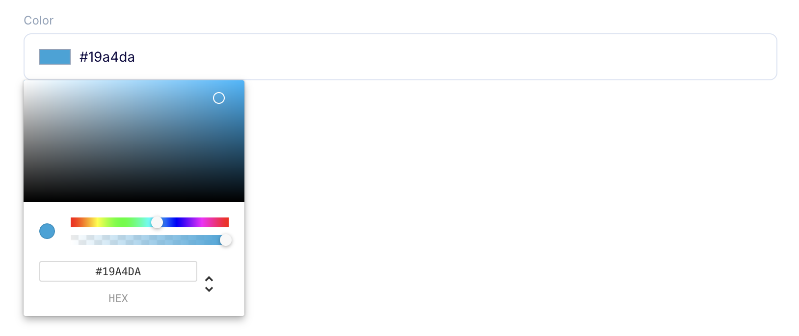
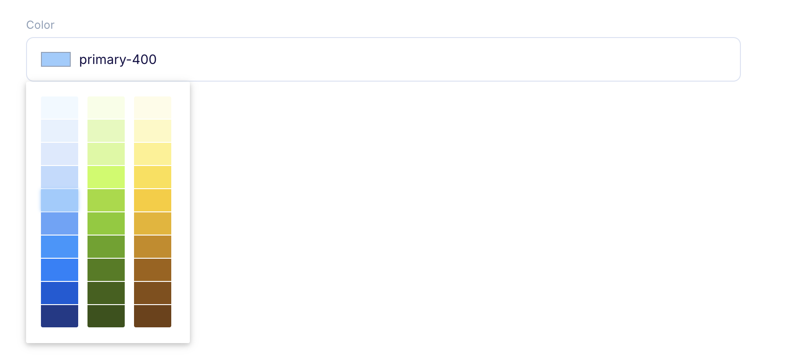
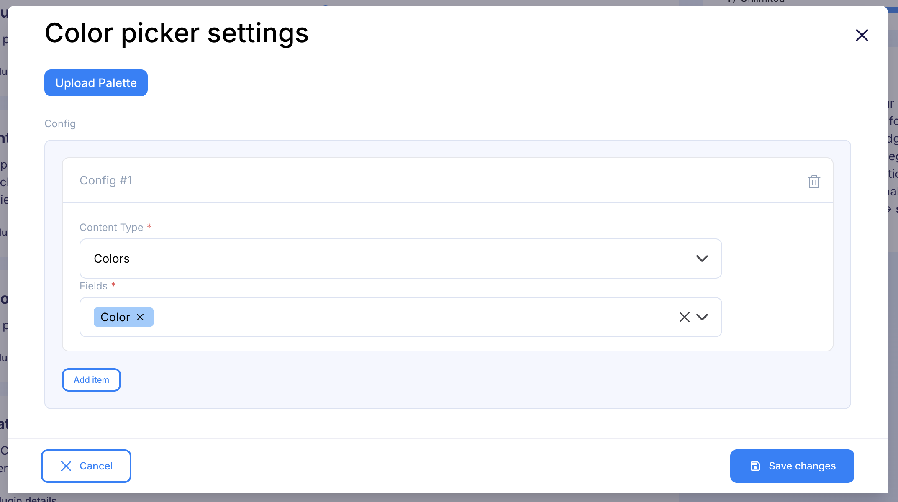
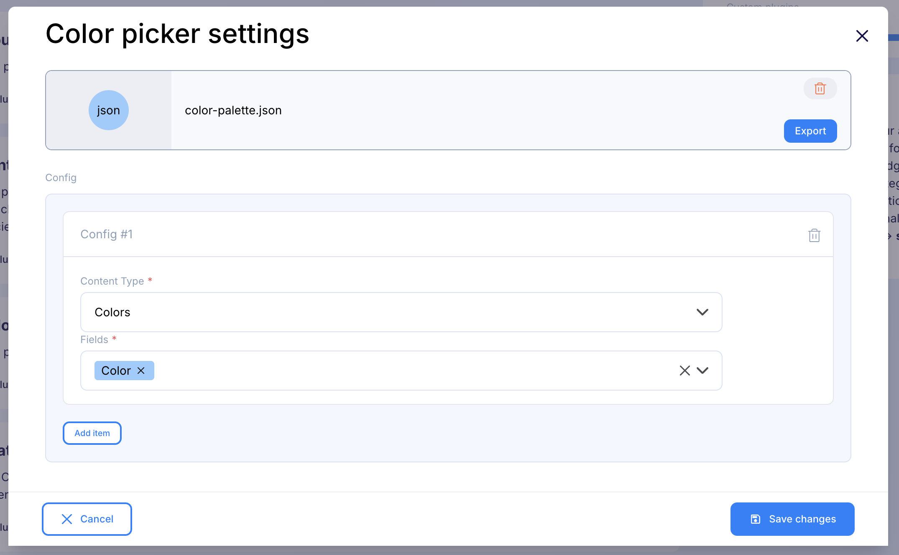

<a href="https://flotiq.com/">
    
</a>

# About Flotiq Color Picker plugin

The Flotiq Color Picker plugin transforms standard text input fields into intuitive color selection interfaces. This plugin provides a visual way to select and manage colors for your content, eliminating the need to manually enter hex color codes.

## Plugin outcome 

Transformed text field into color picker:

**Without predefined color palette**



**With predefined color palette**



## Configuring the plugin

1. First, click "Add Item".
2. Select the Content Type.
3. Choose at least one field to transform for provided Content Type.



After saving the plugin, if custom palette was not uploaded, the selected fields in your content type definition will be automatically updated with a validation pattern (regex) to ensure proper hex color code format. To maintain color validation functionality, please keep this pattern intact and avoid manual removal.

### Custom Color Palette

To use a predefined palette:

1. Click "Upload Palette" in the plugin settings.
2. Choose a JSON file with the correct format (see examples below).

#### Palette Format

The color palette must be a JSON array containing arrays of colors. Each color can be either:
- A simple string (hex color code)
- An object with `name` (any string) and `value` (hex color code) properties

**Example 1: Simple hex colors**
```json
[
  [
    "#F0F9FF",
    "#E7F1FE"
  ],
  [
    "#F7FEE7",
    "#E4F9B9"
  ]
]
```

**Example 2: Named colors**
```json
[
  [
    {
      "name": "primary-50",
      "value": "#F0F9FF"
    },
    {
      "name": "primary-100",
      "value": "#E7F1FE"
    }
  ],
  [
    {
      "name": "secondary-50",
      "value": "#F7FEE7"
    },
    {
      "name": "secondary-100",
      "value": "#E4F9B9"
    }
  ]
]
```

If the format is correct, you should see the chosen file in the plugin settings:




# Development

## Quickstart:

1. `yarn`
2. `yarn start`
3. work work work
4. update your `src/plugin-manifest.json` file to contain the production URL and other plugin information
5. `yarn build`
6. paste js code from `./build/static/js/main.xxxxxxxx.js` to Flotiq console
7. navigate to affected Flotiq pages

Dev environment is configured to use:
- `prettier` - best used with automatic format on save in IDE, remember to run `yarn format` before commiting changes
- `eslint` - it is built into both `start` and `build` commands

## Deployment

<!-- TO DO -->

## Loading the plugin

### URL

1. Open Flotiq editor
2. Open Chrome Dev console
3. Execute the following script
   ```javascript
   FlotiqPlugins.loadPlugin("plugin-id", "<URL TO COMPILED JS>");
   ```
4. Navigate to the view that is modified by the plugin

### Directly

1. Open Flotiq editor
2. Open Chrome Dev console
3. Paste the content of `static/js/main.xxxxxxxx.js`
4. Navigate to the view that is modified by the plugin

### Deployment

1. Open Flotiq editor
2. Add a new plugin and paste the URL to the hosted `plugin-manifest.json` file (you can use `https://localhost:3050/plugin-manifest.json` as long as you have accepted self-signed certificate for this url)
3. Navigate to the view that is modified by the plugin

## Collaborating

If you wish to talk with us about this project, feel free to hop on our [](https://discord.gg/FwXcHnX).

If you found a bug, please report it in [issues](https://github.com/flotiq/flotiq-ui-plugin-templates-plain-js/issues).
